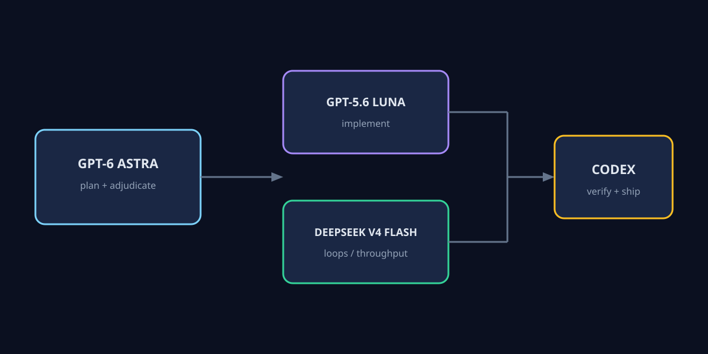

# Astra orchestrator

GPT-6 Astra orchestrates. GPT-5.6 Luna and DeepSeek V4 Flash implement.

A Codex routing skill adapted from [codejunkie99/fable-orchestrator](https://github.com/codejunkie99/fable-orchestrator) (MIT). Same local-first shape: Astra plans and adjudicates; it does not write code or own the workspace. Codex remains the runtime and delegates bounded implementation work to OpenCode Go agents:

- GPT-5.6 Luna handles normal implementation.
- DeepSeek V4 Flash handles loops, repeated iteration, and high-throughput implementation.
- GPT-6 Astra remains outside the implementation graph for planning and final adjudication.

The skill does not ship a proxy, dashboard, model catalog, credential store, or API key. Configure OpenAI auth once (`OPENAI_API_KEY` or OpenAI CLI login), configure OpenCode Go in the router, then restart Codex after changing provider or agent definitions.



## Repository layout

```text
skill/astra/
├── SKILL.md
├── agents/openai.yaml
└── scripts/ask_astra.sh
assets/astra-orchestrator.svg
install.sh
tests/test_skill.sh
```

## Install

```bash
./install.sh --dry-run
./install.sh --copy
```

`--copy` installs to `~/.codex/skills/astra`. Use `--target DIR` for another skills directory.

## Use

```text
$astra build the feature
```

Astra returns a bounded graph. Codex validates it, starts ready workers, verifies, and asks Astra to adjudicate when needed. Every implementation node must use GPT-5.6 Luna or DeepSeek V4 Flash.

## Auth

`ask_astra.sh` calls the OpenAI Responses API with model `gpt-6-astra` (override with `ASTRA_MODEL`). It reads `OPENAI_API_KEY` from the environment. It never writes credentials.

## Test

```bash
tests/test_skill.sh
```

## License

MIT. Includes adapted portions of fable-orchestrator; see [LICENSE](LICENSE).
